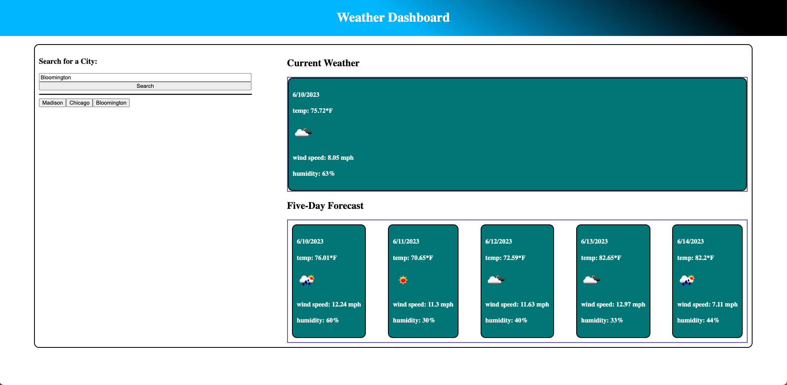

# weather-dashboard

The weather dashboard application shows the current weather and the future weather forecast for five days. Users can enter a city into the search input. History shows up for past cities after they have been searched for. History is stored in local storage. The openweathermap api is used for fetching data. To use this program, go to the link below.

## Link to the Production Version

https://ndockman.github.io/weather-dashboard/

